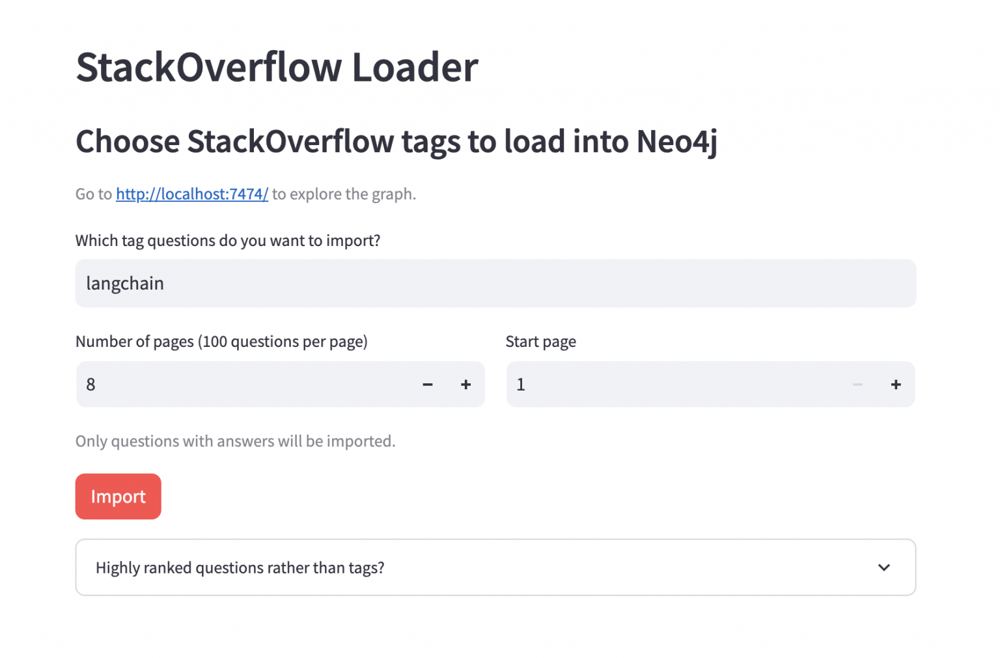
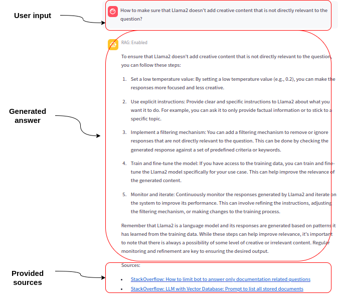
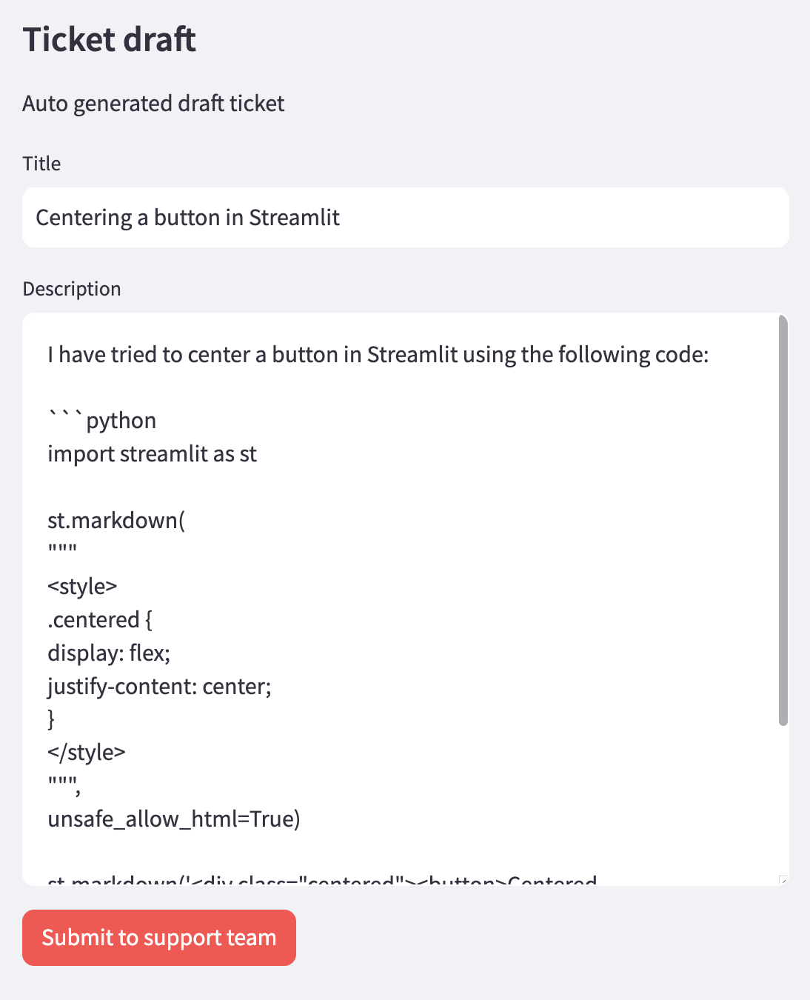

# Welcome to GenAI Stack Workshop

The GenAI Stack is a pre-configured, ready-to-code, and secure environment that makes it easy for developers to build and deploy GenAI applications.

The GenAI Stack is a collaborative effort launched by Docker, Neo4j, LangChain, and Ollama at DockerCon 2023, aimed at streamlining the development of generative AI applications. This stack integrates several cutting-edge technologies to provide developers with a comprehensive toolkit for building AI-powered applications with ease.

Key components of the GenAI Stack include:

1. **Pre-configured Large Language Models (LLMs)**: The stack comes with pre-configured LLMs like Llama2, GPT-3.5, and GPT-4, enabling developers to kickstart their AI projects quickly.

2. **Ollama Management**: Ollama facilitates the local management of open-source LLMs, streamlining the AI development process.

3. **Neo4j as the Default Database**: Neo4j serves as the stack's default database, offering advanced graph and vector search capabilities. This enhances the speed and accuracy of AI/ML models by uncovering complex data patterns and relationships. Additionally, Neo4j acts as a long-term memory for these models, supporting more precise GenAI predictions and outcomes with its knowledge graphs.

4. **LangChain Orchestration**: LangChain provides a framework for applications powered by LLMs, facilitating communication between the LLM, the application, and the database. It includes LangSmith for debugging, testing, evaluating, and monitoring LLM applications.

5. **Comprehensive Support**: Docker and its partners offer a variety of tools, code templates, how-to guides, and best practices to support developers in their GenAI journey.

The [GenAI Stack](https://neo4j.com/labs/genai-ecosystem/genai-stack/) is designed to make AI/ML integration more accessible to developers, offering a ready-to-code and secure environment. By bringing together these technologies, the stack eliminates the need for developers to search for, assemble, and configure disparate technologies from different sources. The stack is available in Early Access and can be accessed from the Docker Desktop Learning Center or directly on [GitHub](https://github.com/docker/genai-stack).

Gen-AI Stack Workshops are a series of workshops designed to teach developers how to build and deploy GenAI applications using the GenAI Stack. These workshops are ideal for developers who are interested in learning more about GenAI or who are looking for a hands-on introduction to the GenAI Stack.

These hands-on labs will be a combination of theory and practical exercises.

## GitHub Sources

The source code for this workshop is available [here](https://github.com/sidagarwal04/genai-workshops-apac).

## Co-Authors

- [Ajeet Singh Raina](https://www.linkedin.com/in/ajeetsraina/) - DevRel @[Docker](https://docker.com)
- [Siddhant Agarwal](https://www.linkedin.com/in/sidagarwal04) - Developer Relations APAC @[Neo4j](https://neo4j.com)

## Benefits of this GenAI Stack Workshop

- [Learn about GenAI and why it is important](lab1/overview/)
- [Learn how to use Docker to containerize and deploy GenAI applications](lab2/what-is-docker/)
- [Learn how to use Neo4j to store and manage knowledge graphs](lab3/intro/)
- [Learn how to use LangChain to generate text, translate languages, and write different kinds of creative content](lab4/intro/)
- [Learn how to use Ollama to train and deploy large language models](lab5/intro-to-ollama/)
- [Learn how to use the GenAI Stack to build and deploy GenAI applications](lab6/using-docker-compose/)
- Get hands-on experience with the GenAI Stack
- Network with other GenAI developers and trainers

# Applications and Uses

## 1. Import and Embed Data From Stack Overflow via Tags

## 2. Support Agent App: Query the Imported Data via a Chat Interface Using Vector + Graph Search

## 3. Generate New Questions in the Style of Highly Ranked Existing Ones

## 4. Read local PDF and ask it questions. Fullstack Python application.

