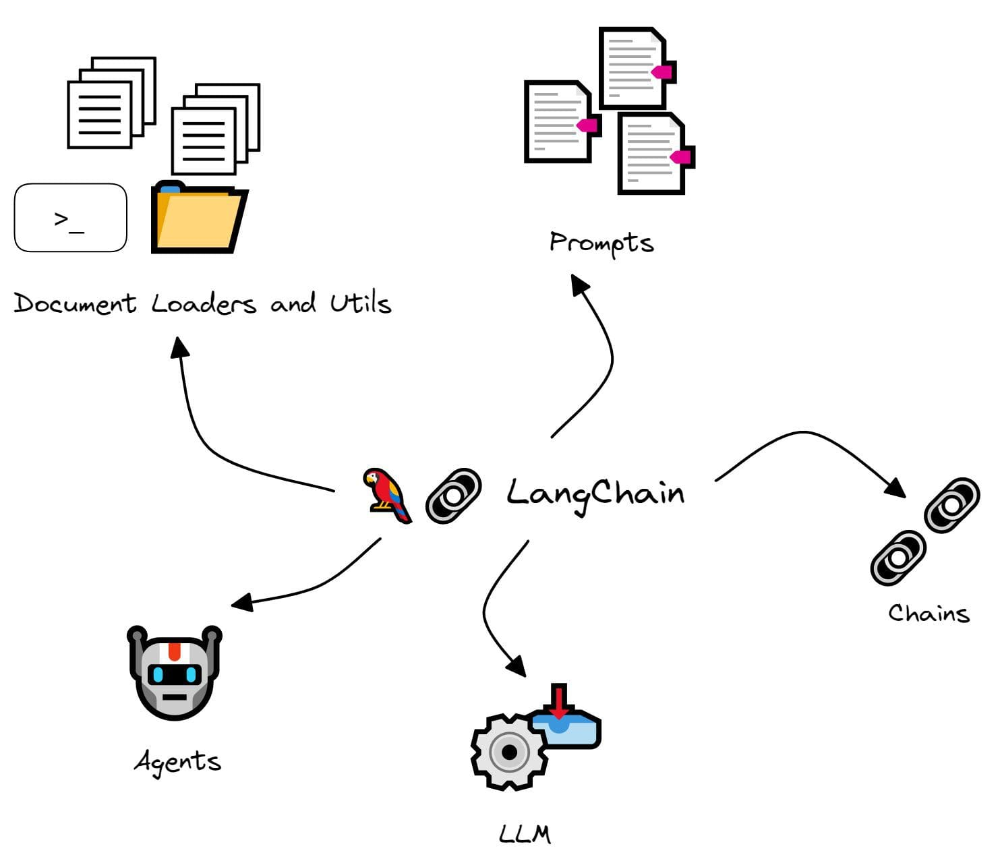

In an era where artificial intelligence (AI) is reshaping industries, Large Language Models (LLMs) stand at the forefront, driving innovation and creativity. However, harnessing their full potential remains a challenge for developers and businesses alike. Enter LangChain, a cutting-edge framework designed to bridge this gap. LangChain is the key to unlocking the vast capabilities of LLMs, making it easier than ever to integrate advanced AI functionalities into applications.

## What is LangChain?

LangChain is an open-source framework that democratizes access to the capabilities of Large Language Models. It is designed to streamline the development of applications ranging from document analysis and summarization to sophisticated chatbots and intricate code analysis. LangChain acts as a conduit between the complex world of LLMs and practical, real-world applications, providing developers with the tools and APIs necessary to integrate AI functionalities seamlessly. Whether you're working with Python or Javascript, LangChain offers the flexibility and resources needed to innovate and excel.

### The Significance of LangChain

Integrating LLMs into applications can be daunting due to their complexity and the technical expertise required. LangChain emerges as a solution to this challenge, simplifying the development process and making it accessible to a broader range of developers. By providing orchestration tools and APIs, LangChain allows developers to focus on the creative aspects of application development, reducing the technical hurdles associated with LLM integration. This democratization of AI tools paves the way for more innovative, efficient, and intelligent applications, transforming how we interact with technology.

Source: [https://www.kdnuggets.com/2023/04/langchain-101-build-gptpowered-applications.html](https://www.kdnuggets.com/2023/04/langchain-101-build-gptpowered-applications.html)

### How does it work?
LangChain applications bridge users and LLMs, communicating back and forth with the LLM through **Chains**.

The key components of a Langchain application are:

- **Model Interaction (Model I/O)**: Components that manage the interaction with the language model, overseeing tasks like feeding inputs and extracting outputs.

- **Data Connection and Retrieval**: Retrieval components can access, transform, and store data, allowing for efficient queries and retrieval.

- **Chains**: Chains are reusable components that determine the best way to fulfill an instruction based on a prompt.

- **Agents**: Agents orchestrate commands directed at LLMs and other tools, enabling them to perform specific tasks or solve designated problems.

- **Memory**: Allow applications to retain context, for example, remembering the previous messages in a conversation.

### Features and Capabilities

LangChain is packed with features that cater to the diverse needs of developers. Its support for both Python and Javascript libraries means that developers can work in their preferred programming environment. LangChain's flexibility extends to a wide range of applications, from automating mundane tasks with chatbots to providing insightful analyses of large datasets. Its intuitive API and comprehensive documentation ensure that even those new to LLMs can start building sophisticated applications quickly. LangChain is not just a tool but a partner in innovation, offering scalability, ease of use, and a community of support.

### Practical Applications of LangChain

The potential applications for LangChain are as vast as the imagination. In customer service, chatbots powered by LangChain can handle inquiries with unprecedented accuracy and nuance, improving user experience. For businesses drowning in data, LangChain can automate document analysis, extracting key insights and summarizing information efficiently. Developers can leverage LangChain for code analysis, enhancing productivity and code quality. These examples barely scratch the surface of what's possible, illustrating LangChain's role as a catalyst for AI-driven solutions across industries.