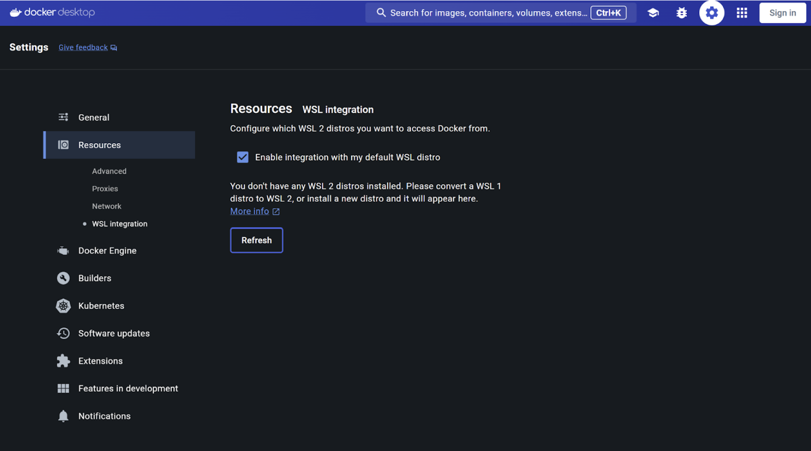

# Prerequisites:

## 1. Docker Desktop

[Download and Install Docker Desktop](https://www.docker.com/products/docker-desktop/) on your system. Make sure you are using Docker Desktop v4.27.2 and above.

 - [Apple Chip](https://desktop.docker.com/mac/main/arm64/Docker.dmg)
 - [Intel Chip](https://desktop.docker.com/mac/main/amd64/Docker.dmg)
 - [Windows](https://desktop.docker.com/win/main/amd64/Docker%20Desktop%20Installer.exe)
 - [Linux](https://docs.docker.com/desktop/linux/install/)

### Enabling WSL 2 based engine on Docker Desktop for Windows

In case you're using Windows 11, you will need to enable WSL 2 by opening Docker Desktop > Settings > Resources > WSL Integration

## 2. Ollama

Download and Install [Ollama](https://ollama.com/) on your system.

Note: For Windows Users, if you have antivirus installed on your system Ollama installation might be flagged as virus. It is advisable to disbale your antivirus/firewall before installation and enable it back once the installation is complete.
